# DevOps23_24

**5. Exécuter un serveur web (apache, nginx, ...) dans un conteneur docker**

**a. Récupérer l'image sur le Docker Hub**

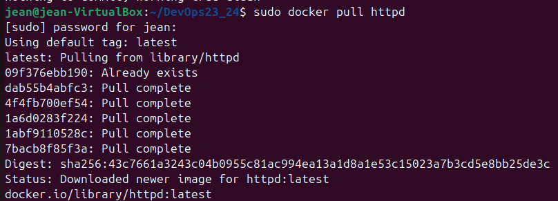

Lien Docker Hub, j'ai opter pour apache : https://hub.docker.com/_/httpd

**b. Vérifier que cette image est présente en local**

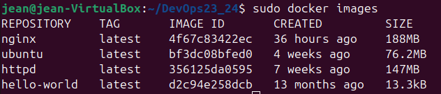

**c. Créer un fichier index.html simple**

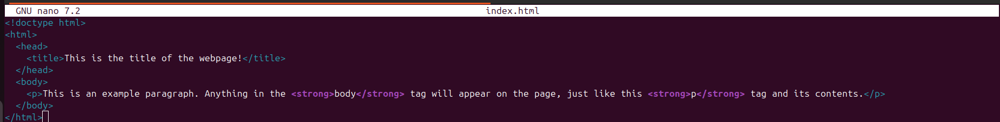

**d. Démarrer un conteneur et servir la page html créée précédemment **à l'aide d'un volume** (option -v de docker run)**

commande utilisé : docker run -d -p 8080:80 -v /home/jean/DevOps23_24/html/index.html:usr/local/apache2/htdocs/index.html httpd:2.4

**e. Supprimer le conteneur précédent et arriver au même résultat avec la commande **docker cp****

pour supprimer le conteneur : sudo docker container rm <identifiant_container>

on récupére l'identifiant avec : docker ps

pour run le conteneur httpd en daemon : sudo docker run -d -p 8080:80 --name my_apache_server httpd

pour copier le fichier demandé dans un docker qui est entrain de run : sudo docker cp /home/jean/DevOps_2324/html/index.html my_apache_server:/usr/local/apache2/htdocs/index.html

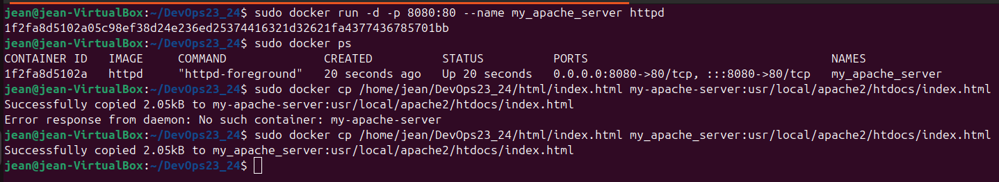

**6. Builder une image**

**a. A l'aide d'un dockerfile, crée une image (commande docker build)**

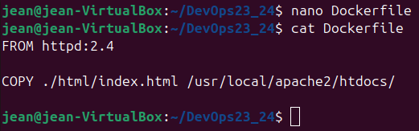

**b. Exécuter cette nouvelle image de maniére à servir la page html (commande docker run)**

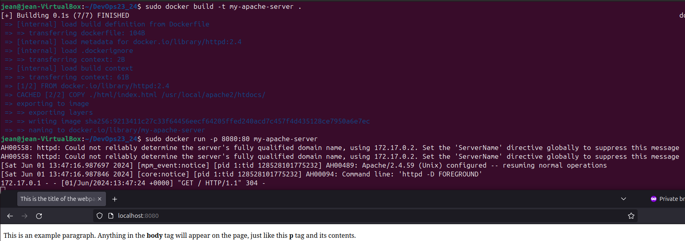
 
**c. Quelles différences observez-vous entre les procédures 5. et 6. ?**

Les deux pour moi permettent différente utilisation en fonction du stade ou l'on se trouve. La méthode 5. est plus adapté pour du "test" c'est à dire on run notre container et on lui balance au fur et à mesure et selon nos besoin les fichiers pour voir un peu l'intéraction en direct les changements etc...

Tandis que la méthode 6. avec une image(dockerfile) me fait beaucoup plus penser à une méthode de production, on a finis de tester on connait les étapes dont on a besoin on les inscrits dans l'image afin d'éviter toute erreur qui ont été essayer durant l'utilisation de la méthode 5.

**7. Utiliser une base de données dans un conteneur docker**

**a. Récupérer les images mysql:5.7 et phpmyadmin depuis le Docker Hub**

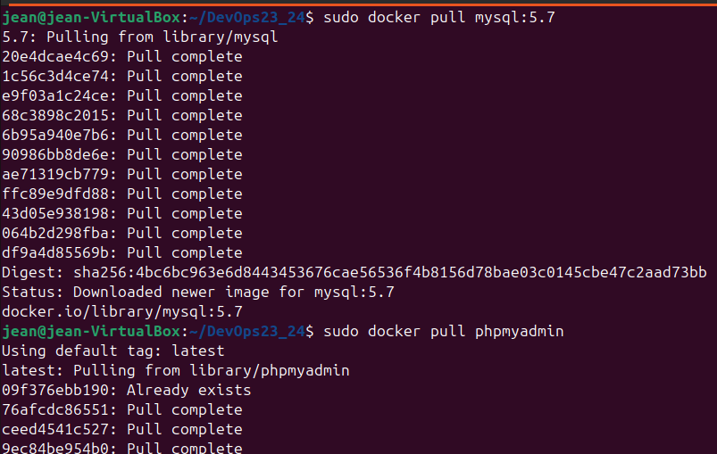

**b. Exécuter deux conteneurs à partir des images et ajouter une table ainsi que quelques enregistrements dans la base de données à l'aide de phpmyadmin**

(Je me suis aidé de ChatGPT pour cette partie)

Créer un network de container afin de permetter à phpmyadmin et mysql de communiquer

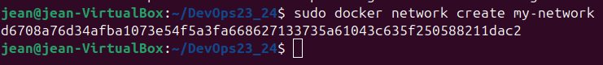

Lancer les deux conteneurs dans le network

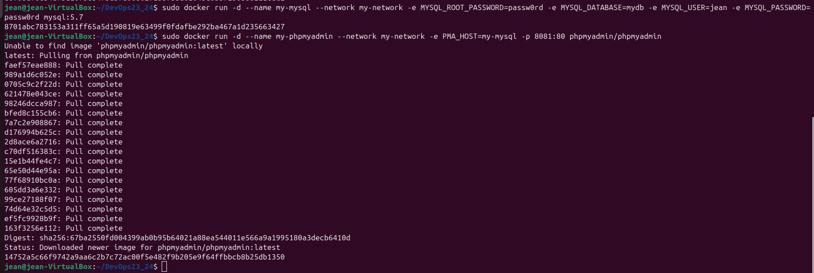

Ensuite accéder à phpmyadmin (via le port 8081)

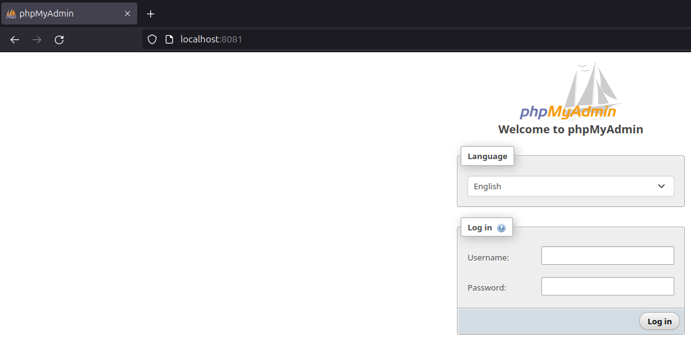

Et se login et créer une table et insérer une valeur

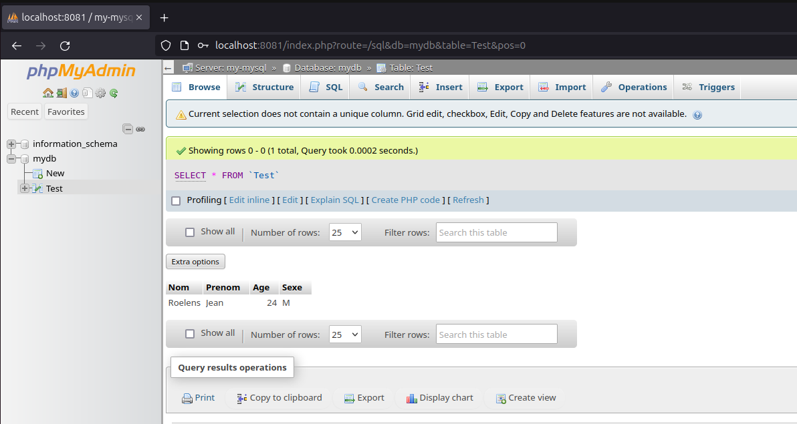

**8. Faire de même avec docker-compose.yml
Attention il faut supprimer les anciens conteneurs si on veux réutiliser les noms my-mysql et my-phpadmin**

Lors du run du docker_compose on peut re effectuer les mêmes opération que dans le 7.

**a. Qu'apporte le fichier docker-compose par rapport aux commandes docker run ? Pourquoi est-il intéressant ?**

Il permet de déployer paramétrer et configurer plusieurs container en même temps c'est un peu le grand frére du dockerfile. Donc comme sont "petit frére" il est utile lors de phase de production lorsque l'architecture à déjà était déterminée.

**b. Quel moyen permet de configurer (premier utilisateur, première base de données, mot de passe root, ...) facilement le conteneur mysql au lancement ?**

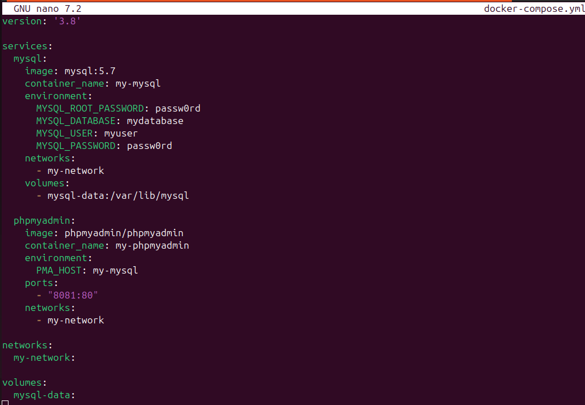

pour configurer :
 - le premier utilisateur : MYSQL_USER
 - la bdd : MYSQL_DATABASE
 - mdp root : MYSQL_ROOT_PASSWORD

C'est assez instinctif.

**9. Observation de l'isolation réseau entre 3 conteneurs**

**a. A l'aide de docker-compose et de l'image praqma/network-multitool créer 3 services (web, app et db) et 2 réseaux (frontend et backend). Les services web et db ne devront pas pouvoir effectuer de ping l'un vers l'autre**

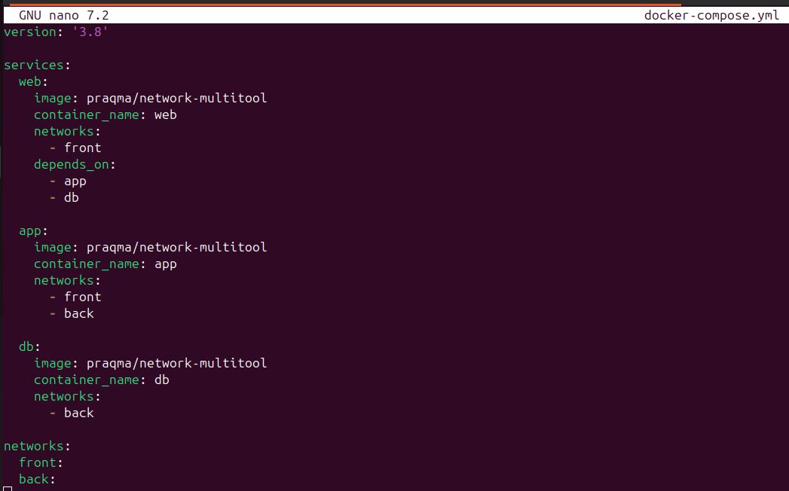
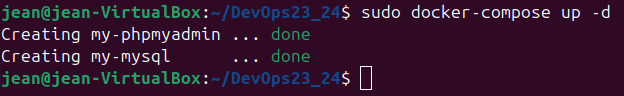
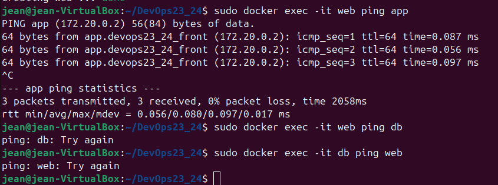

**b. Quelles lignes du résultat de la commande docker inspect justifient ce comportement ?**

Dans l'objet "networks" on peut voir que la configuration front et manquant pour l'un des deux tandis que la configuration back et manquant pour l'autre comme configurer.

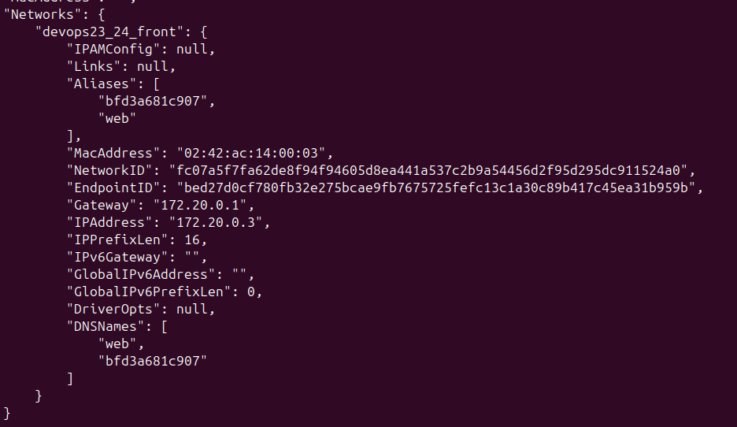
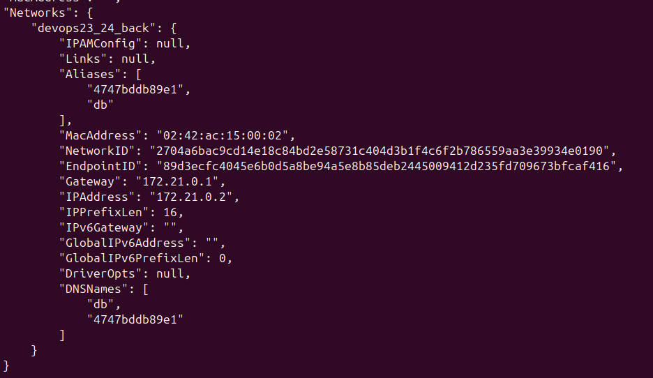

**c. Dans quelle situation réelles (avec quelles images) pourrait-on avoir cette configuration réseau ? Dans quel but ?**

Le but est souvent une raison de sécurité dans notre cas imaginons que front se fait attaquer on ne veut pas que l'attaquant puisse remonter jusqu'a la DB, en bref le but de cette manipulation est d'agir un peu comme une DMZ et laisser l'app agir comme un reverse proxy.
